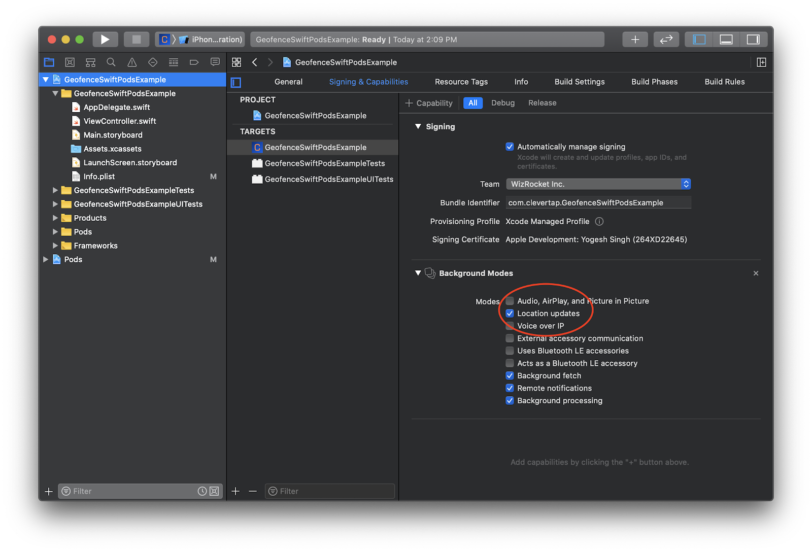
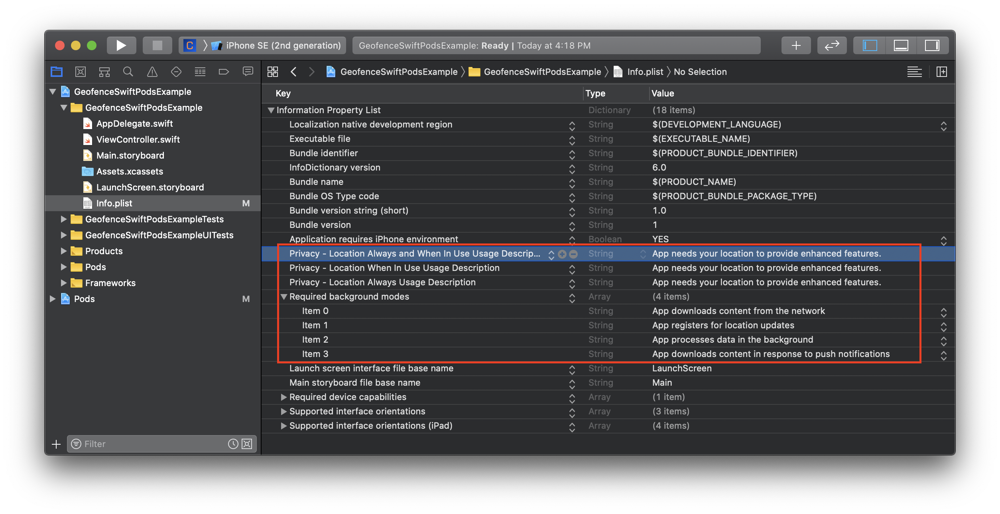
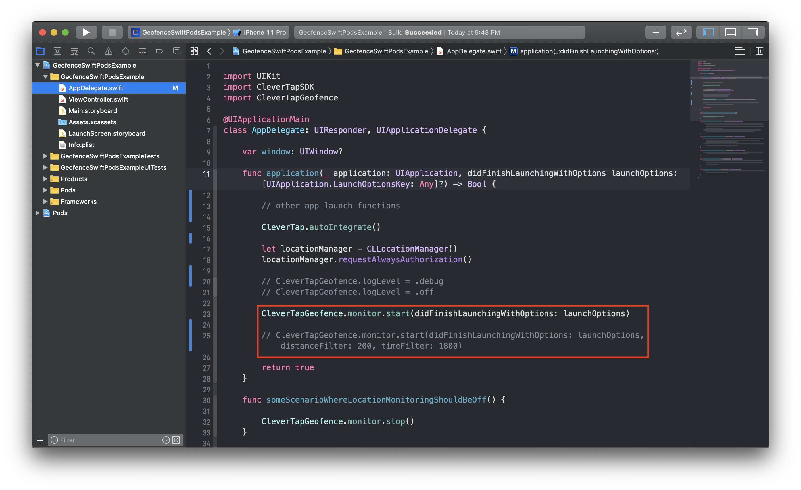

## Introduction

CleverTap Geofence SDK provides Geofencing capabilities to CleverTap iOS SDK by using Core Location framework.

## Contents

- [Installation](#installation)
  - [CocoaPods](#cocoapods)
- [Integration](#integration)
- [Example Usage](#example-usage)
- [Change Log](#changelog)
- [Help and Questions](#help-and-questions)

## Installation

### CocoaPods

[CocoaPods](https://cocoapods.org) is a dependency manager for iOS projects. To integrate CleverTap Geofence SDK into your Xcode project using CocoaPods, specify it in your `Podfile`:

```
pod 'CleverTapGeofence'
```

## Integration

CleverTap Geofence utilizes Core Location APIs to setup up Geofences Region monitoring.
 The CleverTap Geofence will **NOT** request Location permissions from the user. Location Permission has to requested by the app as deemed fit while onboarding the user to the app.
Following are required -
- CleverTap iOS SDK version 3.9.0 or above
- Swift version 5.1 or above
- iOS version 10.0 or above
- CoreLocation iOS Framework
- Ensure that `Location Updates` in `Background Modes` is enabled for your App Target. You can enable this in Xcode by -
  - Click on your `AppTarget` in Xcode Project Navigator
  - Click on `Signing & Capabilities` tab 
  - Click on `+ Capability` button
  - Select the `Background Modes` option
  - Enable `Location Updates` by selecting the checkbox
  
  
- In your Info.plist file, add the following keys -
  - `NSLocationAlwaysAndWhenInUseUsageDescription` also known as `Privacy - Location Always and When In Use Usage Description`
   This is a key which accepts a String description to be used by iOS while requesting Location permission from user.

  - `NSLocationWhenInUseUsageDescription` also known as `Privacy - Location When In Use Usage Description`
  This is a key which accepts a String description to be used by iOS while requesting Location permission from user.

  - `UIBackgroundModes` also known as `Required background modes`
  This is a key which accepts an Array of items. This should include the `location` also known as `App registers for location updates` item to enable Background Location monitoring.

  *For iOS 11 only*: If your app targets iOS 11 then along with the above mentioned 3 Info.plist keys, the following key is also required. If your app target is iOS 12 or above, following is not required -
  - `NSLocationAlwaysUsageDescription` also know as `Privacy - Location Always Usage Description`
  This is a key which accepts a String description to be used by iOS while requesting Location permission from user. Only required for iOS 11.


  Following is an example of all the Info.plist keys in Source Code format -

  ```
  <key>NSLocationAlwaysAndWhenInUseUsageDescription</key>
  <string>App needs your location to provide enhanced features.</string>
  <key>NSLocationWhenInUseUsageDescription</key>
  <string>App needs your location to provide enhanced features.</string>
  <key>NSLocationAlwaysUsageDescription</key>
  <string>App needs your location to provide enhanced features.</string>
  <key>UIBackgroundModes</key>
  <array>
    <string>location</string>
    <string>remote-notification</string>
    <string>fetch</string>
    <string>processing</string>
  </array>
  ```
  


- In your `AppDelegate` file, import the CleverTapGeofence module:

  ```
  // Swift
  import CleverTapGeofence

  // Objective-C
  #import <CleverTapGeofence/CleverTapGeofence-Swift.h>
  ```
  
- In your AppDelegate's `application:didFinishLaunchingWithOptions:` function, add the following the code snippet:

  ```
  // Swift
  CleverTapGeofence.monitor.start(didFinishLaunchingWithOptions: launchOptions)

  // Objective-C
  [[CleverTapGeofence monitor] startWithDidFinishLaunchingWithOptions:launchOptions];
  ```
  
- CleverTap Geofence SDK requires location permission from users to provide the Geofencing capabilities. The App is expected to request Location permission from user at an appropriate time. Once CleverTap Geofence SDK detects that Location permission has been given by user, only then the module will start to perform it's functions.

An example of how an app can request location permission is below:

  ```
  // Swift
  let locationManager = CLLocationManager()
  locationManager.requestAlwaysAuthorization()

  // Objective-C 
  CLLocationManager *locationManager = [[CLLocationManager alloc] init];
  [locationManager requestAlwaysAuthorization];
  ```




## Example Usage

- A [demo application](https://github.com/CleverTap/clevertap-geofence-ios/tree/feature/SDK-104-geofence-support/Examples/CocoapodsExample) showing CocoaPods Installation.
- A [demo application](https://github.com/CleverTap/clevertap-geofence-ios/tree/feature/SDK-104-geofence-support/Examples/CarthageExample) showing Carthage Installation.


## Change Log

See the [CleverTap Geofence SDK Change Log](https://github.com/CleverTap/clevertap-geofence-ios/blob/feature/SDK-104-geofence-support/CHANGELOG.md).


## Help and Questions

If you have questions or concerns, you can reach out to the CleverTap Support Team from your CleverTap Dashboard.
