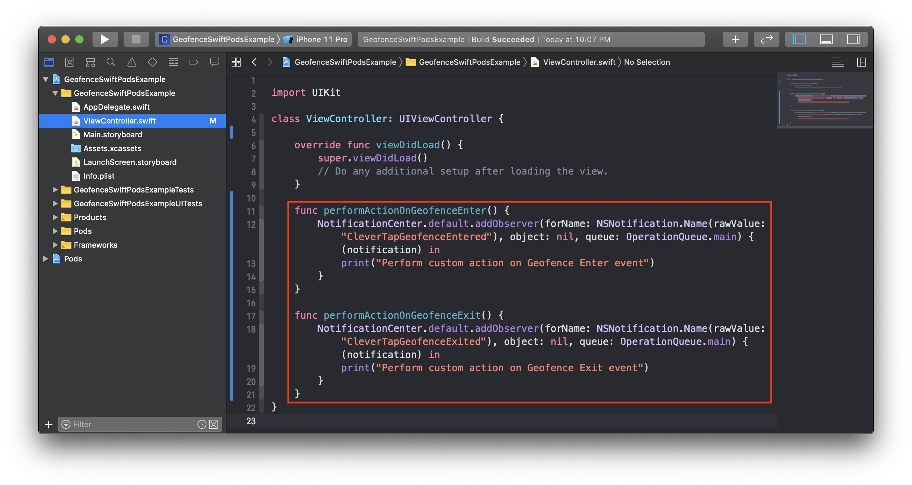

This document lists down further customization for Geofence Module.

## Contents

- [Contents](#contents)
- [Alternative Installation](#alternative-installation)
  - [Carthage](#carthage)
  - [Manual](#manual)
- [Alternative Initialization](#alternative-initialization)
- [Stop Monitoring](#stop-monitoring)
- [Logging](#logging)
- [Geofence Notifications](#geofence-notifications)

## Alternative Installation

### Carthage

[Carthage](https://github.com/Carthage/Carthage) is a decentralized dependency manager that builds your dependencies and provides you with binary frameworks. To integrate CleverTap Geofence SDK into your Xcode project using Carthage, specify it in your `Cartfile`:

```
github "CleverTap/clevertap-geofence-ios"
```

### Manual

CleverTap Geofence SDK can also be integrated manually without any dependency manager. However, this is not a recommended way of integrating. Moreover, the following steps will have to be repeated again for updating to future release versions.

- Download the latest framework release. Unzip the download.

- Add the CleverTapGeofence.xcodeproj to your Xcode Project, by dragging the CleverTapGeofence.xcodeproj under the main project file.

- Embed the framework. Select your app.xcodeproj file. Under "General", add the CleverTapGeofence framework as an embedded binary.


## Alternative Initialization

You can **customize** the minimum distance & time filter for updating user's location using the following alternate initialization API:

  ```
  // Swift
  func start(didFinishLaunchingWithOptions launchOptions: [UIApplication.LaunchOptionsKey : Any]?, distanceFilter: CLLocationDistance = 200, timeFilter: TimeInterval = 1800)

  // Objective-C
  - (void)startWithDidFinishLaunchingWithOptions:(NSDictionary<UIApplicationLaunchOptionsKey, id> *)launchOptions distanceFilter:(CLLocationDistance)distanceFilter timeFilter:(NSTimeInterval)timeFilter;
  ```
  - `distanceFilter`: Specifies the minimum update distance in meters to be used by Geofence location manager. Client will not be notified of movements of less than the stated value, unless the accuracy has improved. By default, 200 meters is used.
  
  - `timeFilter`: Specifies the minimum time in seconds after which location should be updated. Location updates will not be triggered within less than the stated `timeFilter` value. By default, 1800 seconds is used.
  - Following is an example usage in AppDelegate's `application:didFinishLaunchingWithOptions:` function:
  
    ```
    // Swift
    CleverTapGeofence.monitor.start(didFinishLaunchingWithOptions:launchOptions, distanceFilter: 200, timeFilter: 1800)

    // Objective-C
    [[CleverTapGeofence monitor] startWithDidFinishLaunchingWithOptions:launchOptions distanceFilter:200 timeFilter:1800];
    ```


## Stop Monitoring

You can **stop** CleverTap Geofence monitoring at any time using the following API:

  ```
  // Swift
  public func stop()

  // Objective-C
  - (void)stop;
  ```
  
  Following is an example usage within any function of app:
  
  ```
  // Swift
  func someScenarioWhereLocationMonitoringShouldBeOff() {   
    CleverTapGeofence.monitor.stop()
  }

  // Objective-C
  [[CleverTapGeofence monitor] stop];
  ```


## Logging

You can customize **Logging** mode to view more, less or no logs from the Geofence module. This can be done by appropriately setting the `CleverTapGeofenceLogLevel` enum:

  ```
  public enum CleverTapGeofenceLogLevel : Int {

    /// Only errors are logged to console. `.error` is the default
    case error

    /// Logs additional diagnostic info along with `.error` logs for debugging purposes.
    case debug

    /// Stops all logs from `CleverTapGeofence`
    case off
  }
  ```
  
  Ensure that `CleverTapGeofenceLogLevel` is set before invoking `start` function of CleverTap Geofence SDK. An example usage is as follows:
  
  ```
  // Swift
  CleverTapGeofence.logLevel = .debug
  // CleverTapGeofence.logLevel = .off
  CleverTapGeofence.monitor.start(didFinishLaunchingWithOptions: launchOptions)

  // Objective-C
  [CleverTapGeofence setLogLevel:CleverTapGeofenceLogLevelDebug];
  // [CleverTapGeofence setLogLevel:CleverTapGeofenceLogLevelOff];
  [[CleverTapGeofence monitor] startWithDidFinishLaunchingWithOptions:launchOptions];
  ```
  

## Geofence Notifications

You can **subscribe** to Geofence Enter & Exit event notifications to perform any customized actions within the app. 
`CleverTapGeofenceEntered` & `CleverTapGeofenceExited` notifications are fired by the CleverTap Geofence SDK whenever a users transits inside / outside a monitored geofence region. An example of subscribing to these notifications is as follows:

  ```
  // Swift 
  NotificationCenter.default.addObserver(forName: NSNotification.Name(rawValue: "CleverTapGeofenceEntered"), object: nil, queue: OperationQueue.main) { (notification) in
      print("Perform custom action on Geofence Enter event")
  }

  NotificationCenter.default.addObserver(forName: NSNotification.Name(rawValue: "CleverTapGeofenceExited"), object: nil, queue: OperationQueue.main) { (notification) in
      print("Perform custom action on Geofence Exit event")
  }

  // Objective-C
  [[NSNotificationCenter defaultCenter] addObserverForName:@"CleverTapGeofenceEntered" object:nil queue:[NSOperationQueue mainQueue] usingBlock:^(NSNotification * _Nonnull note) {
      NSLog(@"Perform custom action on Geofence Enter event");
  }]

  [[NSNotificationCenter defaultCenter] addObserverForName:@"CleverTapGeofenceExited" object:nil queue:[NSOperationQueue mainQueue] usingBlock:^(NSNotification * _Nonnull note) {
      NSLog(@"Perform custom action on Geofence Exit event");
  }]
  ```


